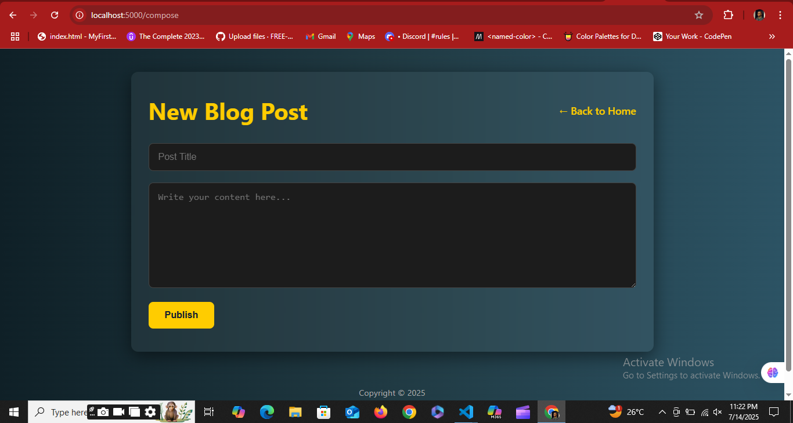

# 📝 My Blog – Node.js & Express Capstone Project

A simple but beautifully styled blog web app built with **Node.js**, **Express.js**, and **EJS**. This project allows users to create, edit, and delete blog posts in a clean and responsive UI — all without a database. It focuses on mastering **routing**, **templating**, **server logic**, and **frontend design** with a real-world structure.

---

## 🚀 Features

- 📝 **Create Posts** – Add blog posts with a title and content.
- 📖 **View Posts** – All posts are shown on the homepage.
- ✏️ **Edit Posts** – Modify any post through a dedicated form.
- ❌ **Delete Posts** – Remove posts with one click.
- 💻 **Responsive UI** – Clean, professional design that works on all devices.
- ⚡ **No Database** – Data is stored temporarily in memory for simplicity.

---

## 📂 Project Structure

blog-app/
├── public/
│   └── styles.css         # Main styling file
├── views/
│   ├── home.ejs           # Homepage with post listings
│   ├── compose.ejs        # Form to add new post
│   ├── edit.ejs           # Form to edit an existing post
│   └── post.ejs           # Single post view
├── app.js                 # Main Express server
├── package.json


---

## 🛠️ Tech Stack

- [Node.js](https://nodejs.org/)
- [Express.js](https://expressjs.com/)
- [EJS](https://ejs.co/)
- [HTML/CSS](https://developer.mozilla.org/en-US/docs/Web/HTML)
- [Flexbox/Grid](https://css-tricks.com/snippets/css/a-guide-to-flexbox/)

---

## 📸 Screenshot


> *Image shows the home screen with post card layout and gradient background.*

---

## ⌛ Development Timeline

| Phase | Description |
|-------|-------------|
| **Hour 0** | Planning, wireframes, route and feature breakdown |
| **Hour 1** | Set up Node.js, Express, folder structure, install dependencies |
| **Hour 2-3** | Built routes and forms for Create, Read, Edit, Delete |
| **Hour 4-5** | Styled the UI (Gradient background, responsive layout, etc) |

---

## 🔍 What I Learned

- Setting up a full Express-based project from scratch
- Using EJS to pass data into templates
- Handling POST and dynamic routes in Express
- Structuring a full CRUD app even without a database
- Writing maintainable CSS and modular EJS templates

---

## ⚠️ Limitations

- Posts are not persistent (disappear on server restart)
- No user authentication or markdown support yet

---

## 📌 Future Plans

- Connect to a MongoDB database to store posts
- Add image upload support for blog posts
- Implement user login/signup
- Add markdown formatting for content
- Deploy to a platform like **Render** or **Railway**

---

## ✅ How to Run

```bash
git clone https://github.com/Stephen-Garry-Git/Blog-Capstone.git
cd Blog-Capstone
npm install
node app.js

```


## 🧠 Inspiration
This project was inspired by Paul Graham’s essays — I wanted to recreate a simple but powerful blog experience with a modern touch.

## 👨‍💻 Author
Stephen Garry# Blog-Post

## Live Demo
Live Demo: [Visit here](https://blog-post-ocza.onrender.com/)
